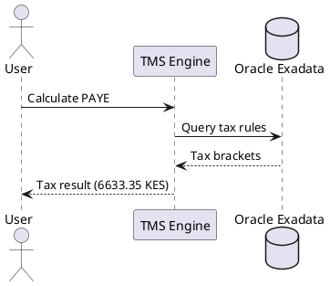

JOHN: Reference this conversation in progression, where corrections were made, follow the corrected approach. This requires reading the entire conversation, not just skimming through it. Let us discuss documentation. proper code should be well document, but I feel like I am missing production grade documentation standards. Specifically, The standard on what format to write the document. I see agents prefering markdown, but I doubt it is the proper standard for writing maintainable technical documents.

EMBER:Excellent instinct. Markdown is convenient for agents, but it's not production-grade for serious technical systems. Here's what real maintainable documentation looks like:

## The Problem with Markdown

**Why agents love it:**
- Easy to generate
- Human-readable
- Works everywhere

**Why it fails at scale:**[1][2][3]
- No semantic structure (presentation-focused, not content-focused)
- No standard extension mechanism (every tool invents its own "flavor")
- Weak cross-referencing (no automatic linking between documents)
- Limited support for complex structures (tables, footnotes, citations)
- No validation or linting built-in
- Can't auto-generate from code effectively

## Production-Grade Formats by Use Case

### 1. **API Documentation: OpenAPI/Swagger Specification**

**Format:** YAML or JSON (machine-readable)[4][5]

**Why it's production-grade:**
- Machine-readable and human-readable
- Generates interactive documentation automatically (Swagger UI)
- Validates API implementation against spec
- Integrates with CI/CD pipelines
- Single source of truth for API contract
- Can generate client SDKs automatically
- Version-controlled with API code

**Example structure:**
```yaml
openapi: 3.0.0
info:
  title: Tax Calculation API
  version: 1.0.0
paths:
  /calculate/paye:
    post:
      summary: Calculate PAYE tax
      requestBody:
        required: true
        content:
          application/json:
            schema:
              $ref: '#/components/schemas/PAYERequest'
      responses:
        '200':
          description: Tax calculation successful
          content:
            application/json:
              schema:
                $ref: '#/components/schemas/TaxResult'
```

**Tools:** Swagger Editor, Stoplight, Postman, Redoc

### 2. **Code Documentation: Language-Native Systems**

**Format:** Depends on language[6][7]

**Rust:** Rustdoc (inline `///` comments)
```rust
/// Calculates PAYE tax based on Kenya tax brackets.
///
/// # Arguments
///
/// * `gross_salary` - Monthly gross salary in KES
/// * `relief` - Personal relief amount (default 2400 KES)
///
/// # Returns
///
/// Tax amount in KES after applying progressive rates
///
/// # Examples
///
/// ```
/// let tax = calculate_paye(50000.0, 2400.0);
/// assert_eq!(tax, 6633.35);
/// ```
pub fn calculate_paye(gross_salary: f64, relief: f64) -> f64 {
    // Implementation
}
```

**Python:** Docstrings + Sphinx (reStructuredText)
**JavaScript:** JSDoc
**Java:** Javadoc

**Why it's production-grade:**
- Integrates directly with IDE (hover documentation, autocomplete)
- Generates searchable HTML docs automatically
- Validated against actual code (compiler checks)
- Can enforce documentation coverage in CI/CD
- Cross-references between functions/modules automatic

### 3. **Architecture Documentation: ADRs + Diagrams-as-Code**

**Format:** Markdown for ADRs (acceptable here), PlantUML/Mermaid for diagrams[7]

**Architecture Decision Records (ADRs):** Markdown is fine here because:
- Short documents (1-2 pages per decision)
- Version-controlled with code
- Historical record, not living documentation

**Diagrams:** Use code-based tools, not image files
- **PlantUML:** Sequence diagrams, class diagrams, deployment diagrams
- **Mermaid:** Flow charts, state diagrams, Gantt charts
- **C4 Model:** System context, containers, components, code-level diagrams

**Why diagrams-as-code is production-grade:**
- Version-controlled (track changes over time)
- Automated generation from code structure
- No drift between diagram and reality
- Searchable, diffable
- Can validate against actual architecture

**Example PlantUML:**


### 4. **User Documentation: reStructuredText (reST) + Sphinx**

**Format:** reStructuredText[2][3][8][1]

**Why reST > Markdown for technical docs:**
- **Semantic structure:** Designed specifically for technical documentation
- **Standard extension mechanism:** Directives and roles (not custom parser hacks)
- **Better cross-referencing:** Automatic linking between documents
- **Rich features built-in:** Footnotes, citations, tables of contents, glossaries
- **Multiple output formats:** HTML, PDF, ePub from single source
- **Math support:** LaTeX equations rendered properly

**Example reST:**
```rst
Tax Calculation API
===================

Overview
--------

The Tax Calculation API provides endpoints for calculating Kenyan taxes.

.. note::
   All amounts are in Kenya Shillings (KES).

PAYE Calculation
~~~~~~~~~~~~~~~~

Calculate Pay-As-You-Earn tax based on Kenya Revenue Authority rates.

.. code-block:: http

   POST /calculate/paye HTTP/1.1
   Content-Type: application/json
   
   {
     "gross_salary": 50000,
     "relief": 2400
   }

.. seealso::
   
   :doc:`tax-rules` for current tax brackets.
```

**Tools:** Sphinx, Read the Docs, MkDocs (markdown alternative)

### 5. **System Documentation: DocBook (Semantic XML)**

**Format:** XML with semantic structure[9][10]

**Why DocBook is production-grade:**
- **Semantic, not presentational:** Separates content from presentation
- **International standard:** OASIS-approved, 25+ years of use[10]
- **Single-source publishing:** Generate multiple formats (HTML, PDF, man pages, ePub)
- **Complex document support:** Books, technical manuals with chapters, sections, appendices
- **Translation-friendly:** XML structure supports localization workflows
- **Validation:** DTD/Schema validation ensures document structure correctness

**When to use DocBook:**
- Large-scale documentation (100+ pages)
- Multi-format output requirements
- Translation into multiple languages
- Long-term maintenance (decades, not years)

**Example DocBook:**
```xml
<?xml version="1.0" encoding="UTF-8"?>
<article xmlns="http://docbook.org/ns/docbook" version="5.0">
  <info>
    <title>Tax Management System Architecture</title>
    <author><personname>System Architecture Team</personname></author>
  </info>
  <section>
    <title>System Overview</title>
    <para>
      The Tax Management System (TMS) provides a modular, 
      API-first tax calculation engine for Kenya Revenue Authority.
    </para>
    <figure>
      <title>System Architecture Diagram</title>
      <mediaobject>
        <imageobject>
          <imagedata fileref="architecture-diagram.svg"/>
        </imageobject>
      </mediaobject>
    </figure>
  </section>
</article>
```

## Docs-as-Code: The Modern Standard[11][12][7]

**Core principles:**
1. **Version control:** Documentation lives in Git alongside code
2. **Automated validation:** CI/CD checks broken links, syntax, style
3. **Code reviews:** Documentation changes go through pull requests
4. **Automated generation:** Extract docs from code where possible
5. **Continuous deployment:** Docs auto-deploy on merge to main

**Workflow:**
```
CODE CHANGE
    ↓
UPDATE API SPEC (OpenAPI YAML)
    ↓
UPDATE CODE COMMENTS (Rustdoc/JSDoc)
    ↓
COMMIT TO GIT
    ↓
CI/CD PIPELINE:
  - Validate OpenAPI spec against code
  - Generate API docs (Swagger UI)
  - Generate code docs (cargo doc)
  - Lint documentation (vale, markdownlint)
  - Check broken links
  - Build user guide (Sphinx)
    ↓
DEPLOY TO DOCS SITE (Read the Docs, GitHub Pages)
```

## Recommendation for Your Systems

For your tax management system (TMS/IMS) and future projects:

### **API Documentation**
- **Format:** OpenAPI 3.0 (YAML)
- **Tool:** Swagger Editor for authoring, Swagger UI for interactive docs
- **Location:** `/api-specs/` folder in repo
- **CI/CD:** Validate spec against actual API on every commit

### **Code Documentation**
- **Format:** Rustdoc (inline `///` comments)
- **Generation:** `cargo doc --no-deps` automated in CI
- **Hosting:** GitHub Pages or internal docs server
- **Coverage:** Enforce minimum 80% documentation coverage

### **Architecture Documentation**
- **ADRs:** Markdown acceptable (`/docs/decisions/`)
- **Diagrams:** PlantUML for technical diagrams (`/docs/diagrams/`)
- **System overview:** C4 model diagrams generated from code structure

### **User/Operator Documentation**
- **Format:** reStructuredText (reST)
- **Tool:** Sphinx + Read the Docs theme
- **Location:** `/docs/` folder in repo
- **Output:** HTML (hosted), PDF (downloadable), ePub (mobile)

### **Large-Scale System Documentation** (if needed for KRA contract)
- **Format:** DocBook 5.2
- **Tool:** XMLMind or Oxygen XML Editor
- **Use case:** Final deliverable documentation (500+ pages, multi-language)

## What Stays in Markdown

Markdown is acceptable for:
- **README files** (project overview, quick start)
- **CONTRIBUTING.md** (contribution guidelines)
- **CHANGELOG.md** (version history)
- **ADRs** (architecture decisions, 1-2 pages each)
- **Internal wikis** (if team prefers, but reST is better)

## Tools to Enforce Standards

**Linting:**
- `vale` - Prose linter (checks style, grammar, consistency)
- `markdownlint` - Markdown syntax checker
- `rstcheck` - reStructuredText validator
- `spectral` - OpenAPI spec linter

**Validation:**
- `swagger-cli validate` - OpenAPI validation
- `cargo doc` - Rustdoc validation (fails if doc syntax broken)
- `sphinx-build -W` - Treat Sphinx warnings as errors

**CI/CD Integration:**
```yaml
# .github/workflows/docs.yml
name: Documentation
on: [push, pull_request]
jobs:
  validate:
    runs-on: ubuntu-latest
    steps:
      - uses: actions/checkout@v3
      - name: Validate OpenAPI spec
        run: swagger-cli validate api-specs/tms-api.yaml
      - name: Generate and test API docs
        run: |
          npm install -g redoc-cli
          redoc-cli bundle api-specs/tms-api.yaml -o docs/api.html
      - name: Build Sphinx docs
        run: |
          pip install sphinx
          cd docs && sphinx-build -W -b html source build
      - name: Check for broken links
        run: linkchecker docs/build/index.html
```

UPDATE: We will use `diagrams.net` in place of PlantUML. We will narrow technical documentation to `reST` for standard documentation and `OpenYAML` for API Documentaiton and language specific documentation for code documentation eg. JSDocs, RUSTDocs, JavaDocs, etc. All other documentation standards will not be followed.

JOHN: OKay. So let us say, I want to use one or two format languages for technical documentation (right now we are focusing on the acual documentaiton document, not code by code documentation like JSDocs or RustDOCS, just the documentation where we say here is documentaiton for apis, here is documentation for user guides, here is documentation for the tms-engine-service (complete with system diagrams).  I want to know which documents are best for it. and remember, we have still suspended tms/ims, as this is more critical and will save us millions of workseconds. What I am asking for is a set of specific, languages (such as yaml, json, xml) that I can reliably use on most cases for developing comprehensive, complete, and production grade docs.

EMBER: Perfect framing. You want **one universal format** (maybe two max) that handles everything, not a different tool for every document type.

Here's the answer:

## The Two-Format Solution

### 1. **reStructuredText (reST)** - Your Universal Documentation Language

**Use for:**
- User guides
- System architecture documents
- API narrative documentation (explaining concepts, workflows)
- Operator manuals
- Design specifications
- Technical reports

**Why reST is the answer:**[1][2][3]

**Syntax:** Text-based markup (human-readable, version-control friendly)

**Example:**
```rst
TMS Engine Service
==================

Overview
--------

The TMS Engine Service calculates taxes using modular rule definitions.

Architecture
------------

.. figure:: diagrams/tms-architecture.png
   :alt: TMS Architecture Diagram
   :width: 600px
   
   Figure 1: TMS System Architecture

The system consists of three layers:

1. **API Gateway** - Handles requests and authentication
2. **Calculation Engine** - Executes tax computations
3. **Rule Storage** - Oracle database with tax definitions

Tax Calculation Flow
~~~~~~~~~~~~~~~~~~~~

When a request arrives:

.. code-block:: text

   User Request → API Gateway → Auth Check → Rule Engine → 
   Calculation → Database Write → Response

See :doc:`api-reference` for endpoint details.

API Endpoints
~~~~~~~~~~~~~

Calculate PAYE
^^^^^^^^^^^^^^

**Endpoint:** ``POST /calculate/paye``

**Request:**

.. code-block:: json

   {
     "gross_salary": 50000,
     "relief": 2400
   }

**Response:**

.. code-block:: json

   {
     "tax_amount": 6633.35,
     "effective_rate": 13.27
   }

.. note::
   All amounts are in Kenya Shillings (KES).

.. seealso::
   
   - :doc:`tax-rules` for current KRA tax brackets
   - :doc:`deployment` for installation instructions
```

**What you get:**
- **Cross-references:** `:doc:` links automatically between documents
- **Code blocks:** Syntax-highlighted examples
- **Diagrams:** Embed images or PlantUML/Mermaid code
- **Tables:** Full table support with headers, spanning cells
- **Admonitions:** Notes, warnings, tips with visual styling
- **Table of contents:** Auto-generated from headings
- **Indexes and glossaries:** For large documentation sets
- **Math equations:** LaTeX rendering for formulas
- **Multiple outputs:** HTML, PDF, ePub, man pages from single source

**Toolchain:**
- **Authoring:** Any text editor (VS Code with reST extension recommended)
- **Generation:** Sphinx (`pip install sphinx`)
- **Output:** `sphinx-build -b html source build` generates website
- **Hosting:** Read the Docs, GitHub Pages, or any web server

**File structure:**
```
docs/
├── source/
│   ├── conf.py              # Sphinx configuration
│   ├── index.rst            # Documentation homepage
│   ├── architecture.rst     # System architecture
│   ├── api-reference.rst    # API documentation
│   ├── user-guide.rst       # User instructions
│   ├── deployment.rst       # Installation guide
│   └── diagrams/
│       ├── tms-architecture.png
│       └── sequence-flow.puml
├── build/                   # Generated HTML/PDF output
└── Makefile                 # Build commands
```

### 2. **OpenAPI YAML** - Machine-Readable API Contracts (Optional)

**Use for:**
- REST API specifications only
- Interactive API documentation
- Contract-first API development
- SDK generation

**Why YAML (not JSON):**
- Human-readable (comments supported)
- Less verbose than JSON
- Industry standard for OpenAPI

**Example:**
```yaml
openapi: 3.0.0
info:
  title: TMS Tax Calculation API
  version: 1.0.0
  description: |
    Calculate Kenyan taxes using Kenya Revenue Authority rules.
    All amounts are in Kenya Shillings (KES).

servers:
  - url: https://api.tms.go.ke/v1
    description: Production server

paths:
  /calculate/paye:
    post:
      summary: Calculate PAYE tax
      description: |
        Calculates Pay-As-You-Earn tax based on monthly gross salary
        and personal relief amount.
      
      requestBody:
        required: true
        content:
          application/json:
            schema:
              $ref: '#/components/schemas/PAYERequest'
            example:
              gross_salary: 50000
              relief: 2400
      
      responses:
        '200':
          description: Tax calculation successful
          content:
            application/json:
              schema:
                $ref: '#/components/schemas/TaxResult'
              example:
                tax_amount: 6633.35
                effective_rate: 13.27
        '400':
          description: Invalid request
          content:
            application/json:
              schema:
                $ref: '#/components/schemas/Error'

components:
  schemas:
    PAYERequest:
      type: object
      required:
        - gross_salary
      properties:
        gross_salary:
          type: number
          format: double
          minimum: 0
          description: Monthly gross salary in KES
        relief:
          type: number
          format: double
          default: 2400
          description: Personal relief amount in KES
    
    TaxResult:
      type: object
      properties:
        tax_amount:
          type: number
          format: double
          description: Calculated tax in KES
        effective_rate:
          type: number
          format: double
          description: Effective tax rate as percentage
    
    Error:
      type: object
      properties:
        error:
          type: string
        message:
          type: string
```

**What you get:**
- **Interactive docs:** Swagger UI generates "Try it out" interface automatically
- **Validation:** Tools validate your API implementation matches spec
- **SDK generation:** Auto-generate client libraries (Python, JavaScript, Java, etc.)
- **Contract testing:** Ensure API responses match schema
- **Version tracking:** Git tracks changes to API contract

**Toolchain:**
- **Authoring:** Stoplight Studio, Swagger Editor, or text editor with YAML validation
- **Generation:** `redoc-cli bundle api-spec.yaml -o api-docs.html`
- **Interactive docs:** Swagger UI or Redoc
- **Validation:** `swagger-cli validate api-spec.yaml`

**When to use OpenAPI YAML vs reST for APIs:**
- **Use OpenAPI YAML:** If you want interactive "Try it out" docs, SDK generation, contract testing
- **Use reST:** If you're documenting API concepts, workflows, authentication, examples narratively
- **Use both:** OpenAPI for machine-readable contract, reST for human explanations and tutorials

## My Recommendation for You

**Start with reST alone for everything.**

Here's why:

1. **Single format to master:** Learn reST once, use everywhere
2. **Covers 95% of documentation needs:** APIs, user guides, architecture, deployment, everything
3. **Version control friendly:** Text files, easy diffs, no binary formats
4. **Future-proof:** Been around since 2002, not going anywhere
5. **Generates everything:** HTML, PDF, ePub, man pages from single source
6. **Low tooling complexity:** Just Sphinx and a text editor

**When to add OpenAPI YAML (later):**
- When you need interactive API documentation with "Try it out" buttons
- When you're building public APIs for third-party developers
- When you want to auto-generate SDKs
- When you need contract-first API development

For now, document your APIs in reST narrative form. If you later need machine-readable specs, you can extract them.

## Alternative: AsciiDoc

**If you don't like reST syntax**, consider **AsciiDoc**:[4]
- Similar power to reST
- Slightly different syntax (some find it cleaner)
- Same output capabilities (HTML, PDF, etc.)
- Tool: Asciidoctor instead of Sphinx

**Comparison:**

| Feature | reStructuredText | AsciiDoc |
|---------|-----------------|----------|
| Maturity | 2002, very mature | 2002, mature |
| Python ecosystem | Excellent (Sphinx) | Good (Asciidoctor is Ruby) |
| Adoption | Python community, Read the Docs | O'Reilly books, Red Hat docs |
| Syntax | `.. directive::` | `[directive]` |
| Learning curve | Moderate | Slightly easier |

**My take:** reST wins for you because:
- Sphinx is more mature and feature-rich
- Better Python integration (your likely tech stack)
- Larger community and more examples
- Read the Docs hosting is seamless

## Practical Setup (30 Minutes)

**Step 1: Install Sphinx**
```bash
pip install sphinx sphinx-rtd-theme
```

**Step 2: Create documentation structure**
```bash
mkdir docs
cd docs
sphinx-quickstart
```

**Step 3: Write first document**
```bash
# docs/source/index.rst
```

**Step 4: Build**
```bash
make html
```

**Step 5: View**
```bash
# Open docs/build/html/index.html in browser
```

## Your Decision Point

**What do you want to do?**

**Option A:** Start with reST only (recommended)
- Single format
- Learn once, use everywhere
- Add OpenAPI later if needed

**Option B:** reST + OpenAPI YAML from day one (Option B has been SELECTED, Option A has been rejected)
- reST for narrative documentation 
- OpenAPI for machine-readable API contracts
- More upfront learning, more power

**Option C:** Evaluate AsciiDoc vs reST
- I'll provide syntax comparison
- You pick based on preference

JOHN: and you said I should use it for normal system docs like tms-engine-service, but default to... what was it again?... for apis? Why is that?

EMBER: Good question. Let me clarify the distinction:

## My Recommendation Was:

**1. reST + Sphinx for EVERYTHING (default)**
- System documentation (tms-engine-service architecture)
- User guides
- Deployment instructions
- API explanations and tutorials
- Architecture documents

**2. OpenAPI YAML for APIs (optional add-on)**
- Machine-readable API contract
- Only if you need specific features OpenAPI provides

## Why OpenAPI YAML for APIs Specifically?

**Because OpenAPI gives you these extras that reST doesn't:**

### 1. **Interactive "Try It Out" Interface**
OpenAPI generates docs where users can:
- Fill in parameters in a form
- Click "Execute" button
- See actual API response from your server
- All without leaving the documentation

**Example:** Swagger UI interface lets developers test your API instantly.

**reST can't do this** - it shows code examples, but users can't execute them in the browser.

### 2. **Automatic SDK Generation**
From OpenAPI spec, you can auto-generate client libraries:
```bash
openapi-generator generate -i api-spec.yaml -g python -o python-client/
openapi-generator generate -i api-spec.yaml -g javascript -o js-client/
openapi-generator generate -i api-spec.yaml -g java -o java-client/
```

**Result:** SDKs for 50+ languages generated automatically from one spec.

**reST can't do this** - it's documentation, not machine-readable contract.

### 3. **Contract Testing & Validation**
OpenAPI spec becomes the contract:
```bash
# Validate your API implementation matches the spec
dredd api-spec.yaml http://localhost:8080
```

Catches when your actual API diverges from documentation.

**reST can't validate** - it's just text describing your API.

### 4. **API Mocking**
Generate mock API server from spec:
```bash
prism mock api-spec.yaml
```

Frontend developers can start working before backend is ready.

**reST can't generate mocks** - no machine-readable structure.

## When You DON'T Need OpenAPI YAML

**If you're building:**
- Internal APIs (team already knows the contract)
- Simple APIs (5-10 endpoints, straightforward)
- APIs where interactive testing isn't needed
- Prototypes or MVPs

**Then:** Just use reST for everything. Document your API narratively:

```rst
API Reference
=============

Calculate PAYE Tax
------------------

**Endpoint:** ``POST /api/v1/calculate/paye``

**Description:** Calculates Pay-As-You-Earn tax based on Kenya Revenue Authority rates.

**Request Body:**

.. code-block:: json

   {
     "gross_salary": 50000,
     "relief": 2400
   }

**Response:**

.. code-block:: json

   {
     "tax_amount": 6633.35,
     "effective_rate": 13.27
   }

**Parameters:**

- ``gross_salary`` (number, required): Monthly gross salary in KES
- ``relief`` (number, optional): Personal relief amount (default: 2400 KES)
```

This is **perfectly adequate** for most use cases.

## When You DO Need OpenAPI YAML

**If you're building:**
- Public APIs for third-party developers
- APIs with 50+ endpoints (gets tedious to document manually)
- APIs that need SDK generation
- APIs where "try it out" feature helps adoption
- Contract-first development (define API before building)

**Then:** Add OpenAPI YAML alongside reST:
- OpenAPI for machine-readable contract
- reST for human-friendly tutorials and concepts

## The Hybrid Approach (Best of Both)

**Typical structure:**
```
docs/
├── source/
│   ├── index.rst              # Homepage
│   ├── quickstart.rst         # Getting started tutorial (reST)
│   ├── architecture.rst       # System design (reST)
│   ├── api/
│   │   ├── overview.rst       # API concepts, auth, errors (reST)
│   │   ├── tutorials.rst      # How to use API (reST)
│   │   └── reference.html     # Generated from OpenAPI (linked)
│   └── deployment.rst         # Ops guide (reST)
└── api-specs/
    └── tms-api.yaml           # OpenAPI spec (generates interactive docs)
```

**Users see:**
- **Tutorials in reST** (how to authenticate, common workflows)
- **Reference in OpenAPI** (every endpoint with "try it out")

## My Actual Recommendation for You

**Start with reST only.**

Here's why:
1. You're building (not releasing yet)
2. Documentation is for your understanding and future team
3. Interactive testing isn't critical yet
4. You want to document fast, iterate fast

**Add OpenAPI later when:**
- You're ready to release APIs publicly
- Third-party developers need to integrate
- You want SDK generation
- Team requests interactive testing

## Summary Table

| Feature | reST + Sphinx | OpenAPI YAML |
|---------|---------------|--------------|
| Human-readable docs | ✅ Excellent | ⚠️ Technical |
| Tutorials & guides | ✅ Perfect | ❌ Not designed for this |
| System architecture | ✅ Perfect | ❌ Not applicable |
| API endpoint reference | ✅ Good enough | ✅ Excellent |
| Interactive "try it" | ❌ No | ✅ Yes |
| SDK generation | ❌ No | ✅ Yes |
| Contract testing | ❌ No | ✅ Yes |
| Learning curve | Moderate | Moderate |
| Setup time | 10 minutes | 30 minutes |

## The Answer

**Use reST for everything.**

**Add OpenAPI only if you specifically need:**
- Interactive API testing in docs
- SDK generation
- Contract validation

Otherwise, reST handles APIs perfectly well. UPDATE: We will use reST+OpenYAML from the start.

JOHN: Next, what types of documentations should a production grade developer have? when responding, I expect this format:
```
Document type [options]:
Details
``` 
For example:
```
System Documentation [Microservices, Backend, Frontend]:
System documentaiton is...
```
If you can provide the most critical and common documentaiton and the proper places to generate them eg. per service, and frequency, eg. immediately upon system design or during development, starting design, ending testing. This will help me decide how to proceed.

EMBER: ## Production-Grade Documentation Types

### System Architecture Documentation [Overall System, Per Microservice, Infrastructure]

Architecture documentation explains how the system is structured, why design decisions were made, and how components interact.

**Scope:**
- **Overall System:** One document for entire platform
- **Per Microservice:** One document per service if complex (10+ services)
- **Infrastructure:** Separate document for deployment architecture

**When to Create:**
- **Initial:** During system design phase (before coding)
- **Update:** After major architectural changes
- **Frequency:** Review quarterly, update as needed

**Location:** `/docs/architecture/`

**Contents:**
- System overview diagram (C4 model: context, containers, components)
- Technology stack and justification
- Component interaction (sequence diagrams, data flow)
- Scalability approach
- Security architecture
- Data persistence strategy
- Integration points with external systems

**Example:** `docs/architecture/tms-engine-architecture.rst`

***

### API Documentation [REST, GraphQL, gRPC, Internal APIs]

Complete reference for all API endpoints, including request/response formats, authentication, and error handling.

**Scope:**
- **Public APIs:** OpenAPI spec + narrative docs (REST), GraphQL schema + playground
- **Internal APIs:** Same standard as public (services communicate via APIs)
- **gRPC:** Protocol buffer definitions + generated docs

**When to Create:**
- **Initial:** Contract-first (before implementation) OR during implementation
- **Update:** Every API change (automated via CI/CD)
- **Frequency:** Continuous (part of development workflow)

**Location:** 
- Specs: `/api-specs/` (OpenAPI YAML, GraphQL schema, .proto files)
- Narrative: `/docs/api-reference/`

**Contents:**
- Authentication/authorization
- Rate limits and quotas
- All endpoints with examples
- Error codes and meanings
- Versioning strategy
- Pagination, filtering, sorting conventions
- Webhook documentation (if applicable)

**Example:** `api-specs/tms-rest-api.yaml`, `docs/api-reference/authentication.rst`

***

### Code Documentation [Inline Comments, Function/Module Docs, Package Docs]

Documentation embedded in code explaining what functions/modules do, their parameters, return values, and usage examples.

**Scope:**
- **Per Function/Method:** Inline docstrings (Rustdoc, JSDoc, Python docstrings)
- **Per Module/Package:** Module-level documentation
- **Per Repository:** README with quick start

**When to Create:**
- **Initial:** During development (write docs as you code)
- **Update:** Every function change
- **Frequency:** Continuous (part of code review)

**Location:** Inline in source code files

**Contents:**
- Function/method purpose
- Parameters (types, constraints, defaults)
- Return values (type, possible values)
- Exceptions/errors thrown
- Usage examples
- Performance considerations (if critical)
- Thread safety notes (if concurrent)

**Example:**
```rust
/// Calculates PAYE tax based on Kenya Revenue Authority rates.
///
/// # Arguments
///
/// * `gross_salary` - Monthly gross salary in KES
/// * `relief` - Personal relief amount (default: 2400 KES)
///
/// # Returns
///
/// Tax amount in KES after applying progressive rates
///
/// # Examples
///
/// ```
/// let tax = calculate_paye(50000.0, 2400.0);
/// assert_eq!(tax, 6633.35);
/// ```
pub fn calculate_paye(gross_salary: f64, relief: f64) -> f64 {
```

***

### Deployment Documentation [Infrastructure, CI/CD, Environment Setup]

Step-by-step instructions for deploying the system, from local development to production.

**Scope:**
- **Per Environment:** Development, staging, production
- **Per Service:** If deployment differs significantly
- **Infrastructure:** Overall infrastructure setup (Kubernetes, cloud resources)

**When to Create:**
- **Initial:** Before first deployment
- **Update:** Every infrastructure change
- **Frequency:** Review monthly, update as needed

**Location:** `/docs/deployment/`

**Contents:**
- Prerequisites (tools, accounts, access)
- Local development setup
- Environment variables and secrets
- Database migration procedures
- Deployment steps (automated and manual fallback)
- Rollback procedures
- Monitoring and health checks
- Disaster recovery procedures

**Example:** `docs/deployment/production-deployment.rst`

***

### Operations/Runbook Documentation [Monitoring, Troubleshooting, Incident Response]

Operational procedures for running the system in production, including troubleshooting common issues.

**Scope:**
- **Per Service:** Critical services get dedicated runbooks
- **Overall System:** Common operational procedures

**When to Create:**
- **Initial:** Before production launch
- **Update:** After every major incident (post-mortem)
- **Frequency:** Review monthly, update after incidents

**Location:** `/docs/operations/`

**Contents:**
- System health indicators
- Monitoring dashboards and alerts
- Common failure scenarios and fixes
- Performance tuning procedures
- Backup and restore procedures
- Log locations and analysis
- On-call escalation procedures
- Incident response workflow

**Example:** `docs/operations/tms-engine-runbook.rst`

***

### Database Documentation [Schema, Migrations, Data Dictionary]

Complete documentation of database structure, relationships, and data management procedures.

**Scope:**
- **Per Database:** One document per logical database
- **Per Schema:** If multiple schemas in one database

**When to Create:**
- **Initial:** During database design
- **Update:** Every schema change (automated from migrations)
- **Frequency:** Continuous (with migrations)

**Location:** `/docs/database/`

**Contents:**
- Entity-relationship diagrams (ERD)
- Table definitions (columns, types, constraints)
- Index strategy and rationale
- Data retention policies
- Migration procedures
- Backup and recovery procedures
- Performance optimization notes

**Example:** `docs/database/tms-core-schema.rst`

***

### Configuration Documentation [Environment Variables, Feature Flags, Service Config]

Documentation of all configuration options, their meanings, and valid values.

**Scope:**
- **Per Service:** Each service's configuration
- **Infrastructure:** Shared configuration (databases, message queues)

**When to Create:**
- **Initial:** During service setup
- **Update:** Every new configuration option
- **Frequency:** Continuous

**Location:** `/docs/configuration/`

**Contents:**
- Environment variable reference
- Configuration file formats
- Feature flags and their effects
- Default values and overrides
- Security considerations (secrets management)
- Configuration validation

**Example:** `docs/configuration/tms-engine-config.rst`

***

### Architecture Decision Records (ADRs) [Technology Choices, Design Decisions]

Historical record of significant architectural and design decisions, including context and alternatives considered.

**Scope:**
- **Per Project:** All significant decisions in one folder
- **Per Decision:** One ADR per decision

**When to Create:**
- **Initial:** When making significant technical decisions
- **Update:** Never (ADRs are immutable historical records)
- **Frequency:** As needed (typically 5-10 per year for active projects)

**Location:** `/docs/decisions/`

**Contents:**
- Title (decision summary)
- Status (proposed, accepted, deprecated, superseded)
- Context (problem, constraints)
- Decision (what was chosen)
- Consequences (positive and negative)
- Alternatives considered (and why rejected)

**Example:** `docs/decisions/0003-use-rust-for-tax-engine.md`

***

### Testing Documentation [Test Strategy, Test Cases, Test Data]

Documentation of testing approach, coverage, and how to run tests.

**Scope:**
- **Per Project:** Overall test strategy
- **Per Service:** Service-specific test notes

**When to Create:**
- **Initial:** During development planning
- **Update:** When test strategy changes
- **Frequency:** Review quarterly

**Location:** `/docs/testing/`

**Contents:**
- Test pyramid (unit, integration, E2E percentages)
- Test coverage requirements
- How to run tests locally
- CI/CD test automation
- Performance test procedures
- Load testing strategy
- Test data management

**Example:** `docs/testing/test-strategy.rst`

***

### Security Documentation [Threat Model, Security Controls, Compliance]

Documentation of security architecture, vulnerabilities, mitigations, and compliance requirements.

**Scope:**
- **Per Project:** Overall security architecture
- **Per Service:** Service-specific security notes (if handling sensitive data)

**When to Create:**
- **Initial:** During security design phase
- **Update:** After security audits or incidents
- **Frequency:** Review quarterly, update after audits

**Location:** `/docs/security/`

**Contents:**
- Threat model (assets, threats, mitigations)
- Authentication and authorization mechanisms
- Data encryption (at rest, in transit)
- Security controls (firewalls, rate limiting, input validation)
- Vulnerability management process
- Compliance mappings (GDPR, PCI-DSS, etc.)
- Incident response procedures

**Example:** `docs/security/threat-model.rst`

***

### User Documentation [User Guides, Tutorials, FAQs]

End-user facing documentation explaining how to use the system.

**Scope:**
- **Per User Type:** Different guides for different personas
- **Per Feature:** Major features get dedicated guides

**When to Create:**
- **Initial:** Before user release (MVP)
- **Update:** Every feature release
- **Frequency:** Continuous (with feature development)

**Location:** `/docs/user-guide/`

**Contents:**
- Getting started tutorial
- Feature-by-feature guides
- Common workflows
- Troubleshooting FAQs
- Video tutorials (optional)
- Glossary of terms

**Example:** `docs/user-guide/filing-tax-returns.rst`

***

### Change Documentation [CHANGELOG, Release Notes, Migration Guides]

Record of what changed between versions, including breaking changes and migration instructions.

**Scope:**
- **Per Project:** One CHANGELOG file
- **Per Major Release:** Detailed release notes

**When to Create:**
- **Initial:** From first release
- **Update:** Every release
- **Frequency:** Continuous (with releases)

**Location:** `/CHANGELOG.md` (root), `/docs/release-notes/`

**Contents:**
- Version number and date
- Added features
- Changed behavior
- Deprecated features
- Removed features
- Fixed bugs
- Security fixes
- Breaking changes
- Migration instructions (for breaking changes)

**Example:** `CHANGELOG.md`, `docs/release-notes/v2.0-migration.rst`

***

### Onboarding Documentation [Developer Setup, Contributing Guide, Code Style]

Documentation for new developers joining the project.

**Scope:**
- **Per Project:** One onboarding guide

**When to Create:**
- **Initial:** After initial development
- **Update:** When development workflow changes
- **Frequency:** Review quarterly

**Location:** `README.md`, `/docs/contributing/`

**Contents:**
- Development environment setup
- Repository structure explanation
- How to run locally
- How to run tests
- Code style guidelines
- Git workflow (branching, PRs)
- Code review process
- Where to ask questions

**Example:** `CONTRIBUTING.md`, `docs/contributing/development-setup.rst`

***

### Dependency Documentation [Third-Party Services, Libraries, Licenses]

Record of external dependencies, their purposes, versions, and licenses.

**Scope:**
- **Per Project:** One dependency document

**When to Create:**
- **Initial:** Before using third-party services/libraries
- **Update:** When adding/removing dependencies
- **Frequency:** Review quarterly

**Location:** `/docs/dependencies/`

**Contents:**
- List of dependencies with versions
- Purpose of each dependency
- License compliance notes
- Alternatives considered
- Vendor lock-in risks
- API rate limits (for external services)
- SLA and support contact information

**Example:** `docs/dependencies/third-party-services.rst`

***

### Performance Documentation [Benchmarks, Optimization, Capacity Planning]

Documentation of system performance characteristics and optimization strategies.

**Scope:**
- **Per Service:** Critical services get performance docs
- **Overall System:** System-wide performance characteristics

**When to Create:**
- **Initial:** After performance testing
- **Update:** After optimization work
- **Frequency:** Review quarterly, update after major changes

**Location:** `/docs/performance/`

**Contents:**
- Benchmark results (throughput, latency)
- Performance targets (SLAs)
- Load testing results
- Bottlenecks identified
- Optimization strategies applied
- Capacity planning (scaling thresholds)
- Cost implications of scale

**Example:** `docs/performance/tms-engine-benchmarks.rst`

***

## Priority Matrix (What to Create First)

### Critical (Must Have Before Production)
1. **API Documentation** - Developers can't integrate without it
2. **Deployment Documentation** - Can't deploy without it
3. **Operations/Runbook** - Can't maintain production without it
4. **Security Documentation** - Compliance and audit requirements

### Important (Should Have Soon After Launch)
5. **System Architecture** - Team understanding and onboarding
6. **Database Documentation** - Data integrity and migrations
7. **Configuration Documentation** - Environment management
8. **User Documentation** - Reduces support burden

### Useful (Create as Needed)
9. **ADRs** - Capture decisions as they happen
10. **Testing Documentation** - Quality assurance
11. **Change Documentation** - Version management
12. **Code Documentation** - Continuous (part of development)

### Nice to Have (Lower Priority)
13. **Onboarding Documentation** - When team grows
14. **Dependency Documentation** - Audit and compliance
15. **Performance Documentation** - After optimization phase

***

## Recommended Workflow

**Phase 1: Design (Before Coding)**
- System Architecture Documentation
- API Documentation (contract-first)
- Database Documentation (schema design)
- Security Documentation (threat model)

**Phase 2: Development (During Coding)**
- Code Documentation (inline, continuous)
- ADRs (as decisions are made)
- Configuration Documentation (as options added)

**Phase 3: Testing (Before Launch)**
- Testing Documentation
- Deployment Documentation
- Operations/Runbook Documentation

**Phase 4: Launch (Before Production)**
- User Documentation
- Change Documentation (CHANGELOG)

**Phase 5: Maintenance (Ongoing)**
- Update all docs as system evolves
- Performance Documentation (after optimization)
- Dependency Documentation (quarterly reviews)

***
EOF

